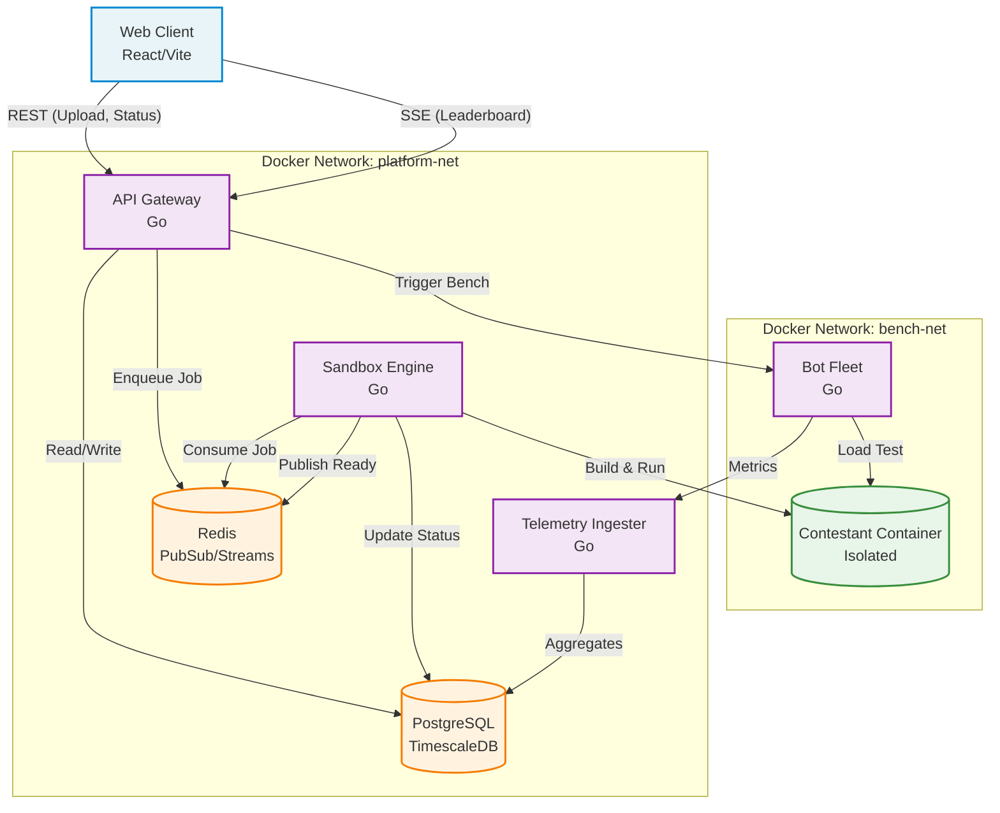

# Tradebench Architecture

This document describes the overall architecture of the Tradebench platform, the data flow, and frontend component structure.

## High-Level System Architecture

Tradebench is composed of several microservices coordinated via Docker Compose, communicating via REST, Server-Sent Events (SSE), and gRPC.



## Frontend Component Tree & Data Flow

The frontend is a React application built with Vite. It uses a purely state-driven approach for routing (no React Router) and emphasizes separation of transport logic from UI presentation.

### Component Structure

```mermaid
graph TD
    App[App.tsx\n(View Switcher)] --> TopBar[TopBar.tsx]
    App --> Submit[Submit.tsx\n(Page)]
    App --> Leaderboard[Leaderboard.tsx\n(Page)]
    
    Submit --> UploadForm[UploadForm.tsx]
    Submit --> PipelineTracker[PipelineTracker.tsx]
    Submit --> MetricsPanel[MetricsPanel.tsx]
    Submit --> hooks[useSubmissionStatus.ts]
    
    Leaderboard --> LeaderboardTable[LeaderboardTable.tsx]
    LeaderboardTable --> StatusBadge[StatusBadge.tsx]
    Leaderboard --> SSEClient[sse.ts\n(Transport)]
```

### Data Flow

1.  **Submission Flow:** 
    - The user uploads a ZIP in `UploadForm`.
    - `Submit.tsx` receives the `submissionId` and begins polling via `useSubmissionStatus`.
    - `useSubmissionStatus` polls `GET /api/submissions/:id/status` and yields phase transitions (`idle` → `loading` → `polling` → `success`/`failed`/`timeout`).
    - The `PipelineTracker` visually reflects the current status (`UPLOADED`, `BUILDING`, `RUNNING`, etc.).
    - When the phase becomes `success` (i.e. status is `SCORED`), `Submit.tsx` fetches the final results (`GET /api/submissions/:id/results`) and displays the `MetricsPanel`.

2.  **Leaderboard Flow:**
    - `Leaderboard.tsx` initially fetches the static leaderboard via `GET /api/leaderboard`.
    - It immediately establishes an SSE connection using `LeaderboardSSEClient` (`GET /api/leaderboard/stream`).
    - The SSE stream pushes new rankings whenever a benchmark finishes.
    - `LeaderboardTable` maintains a reference to the previous rankings to compute rank changes (▲/▼) and applies CSS flash animations to updated rows.

## API Contracts & Design Decisions

### 1. Presentation-Agnostic Transport
All API calls are localized in `api/client.ts` and `api/sse.ts`. React components never call `fetch` or instantiate `EventSource` directly. The `LeaderboardSSEClient` is a pure transport wrapper that provides a robust reconnect cycle without cluttering the UI component with side effects.

### 2. Error Handling
All responses from the backend are wrapped in a standard `ApiErrorShape` (`{ error: string, code: string }`). The frontend `parseResponse` utility intercepts non-OK responses and throws an `ApiError` instance, ensuring that UI components can catch and display consistent error messages.

### 3. Asynchronous Benchmarking Pipeline
The backend handles benchmarking asynchronously using Redis Streams:
- `api-gateway` uploads the file, creates a DB record, and enqueues the job to Redis (`stream:jobs`).
- `sandbox-engine` consumes the job, builds the Docker image, and spawns the container on `bench-net`.
- Once the container is healthy, `sandbox-engine` publishes a `ready` event to Redis.
- A trigger watcher in `api-gateway` listens for `ready` events and triggers the `bot-fleet` via gRPC to begin load testing.

### 4. Network Isolation
Security is enforced at the network level. Contestant containers are spawned by `sandbox-engine` onto a completely isolated bridge network called `bench-net`. Only the `bot-fleet` is connected to both `platform-net` and `bench-net`, acting as the sole ingress point for the load tests. Contestant code cannot reach the internet or the database.

### 5. Leaderboard SSE Strategy
The `api-gateway` uses an active polling ticker (every 2 seconds by default) to broadcast the latest leaderboard to all connected SSE clients, ensuring real-time updates for all observers during active benchmarking.
