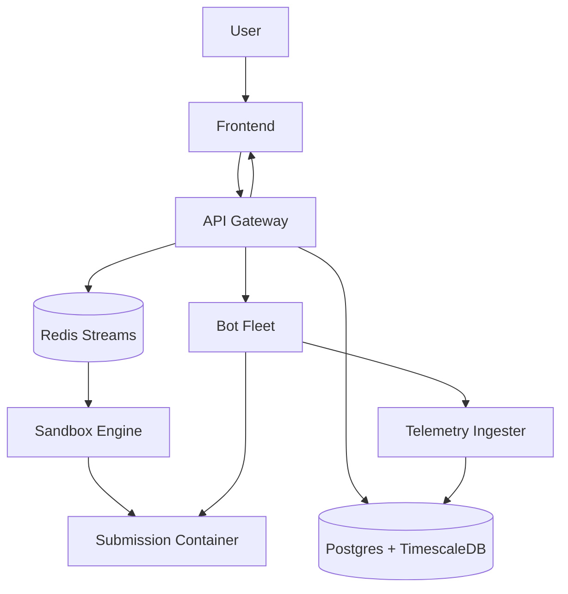
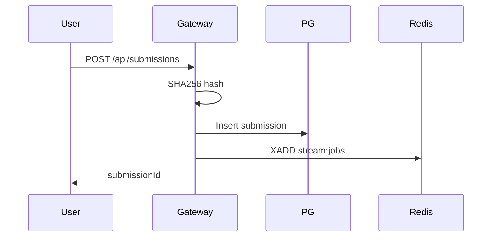
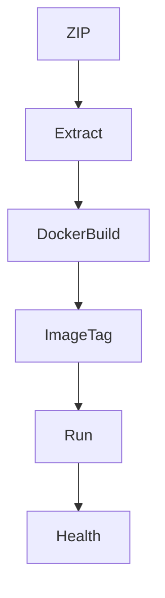
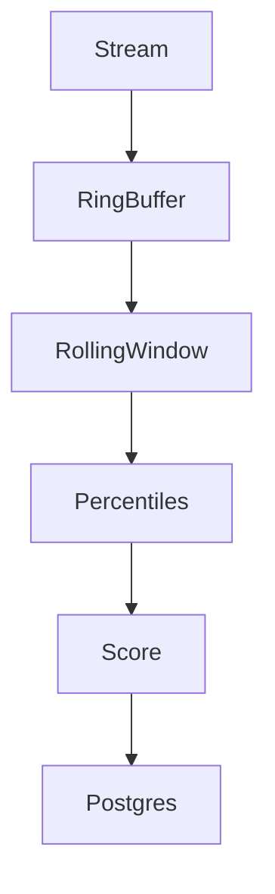

# TradeBench Architecture

## Overview

TradeBench is a distributed benchmarking platform for evaluating trading exchange implementations.

The system accepts contestant submissions as ZIP archives, builds them into Docker images, deploys them inside isolated containers, benchmarks them under concurrent load, aggregates telemetry, computes scores, and publishes a live leaderboard.

The architecture favors:

- service separation
    
- explicit contracts
    
- asynchronous pipelines
    
- container isolation
    
- deterministic scoring
    
- minimal external dependencies
    

---

# Goals

### Functional Goals

- Automated submission pipeline
    
- Isolated execution of untrusted code
    
- Large scale concurrent benchmarking
    
- Real-time leaderboard
    
- Deterministic scoring
    

---

### Non Functional Goals

- Single command deployment
    

```bash
docker compose up
```

- Secure container execution
    
- Failure isolation
    
- Horizontally scalable benchmark layer
    
- Observable execution pipeline
    

---

# Architecture Principles

### 1. Shared Contracts

Inter-service communication occurs only through:

- REST
    
- Redis Streams
    
- gRPC
    

Shared protobuf definitions live in:

```text
shared/proto
```

and are generated into:

```text
shared/proto/gen
```

---

### 2. Asynchronous Pipeline

Benchmarking is asynchronous.

Uploads do not block until benchmarking completes.

The API returns immediately after:

- file upload
    
- DB insert
    
- Redis enqueue
    

The remaining pipeline runs in the background.

---

### 3. Untrusted Code Isolation

Contestant code:

- never joins platform-net
    
- never sees Postgres
    
- never sees Redis
    
- has no internet access
    
- runs as non-root
    

Isolation is enforced by Docker networking.

---

# High Level Architecture



---

# Docker Networks

Two isolated bridge networks exist.

---

## platform-net

Connected services:

- api-gateway
    
- sandbox-engine
    
- bot-fleet
    
- telemetry-ingester
    
- postgres
    
- redis
    

Purpose:

Internal service communication.

---

## bench-net

Connected services:

- bot-fleet
    
- contestant containers
    

Purpose:

Benchmark traffic only.

Configured as:

```yaml
internal: true
```

No internet access.

No database access.

No Redis access.

Only Bot Fleet may communicate with submissions.

This is the primary security boundary.

---

# Upload Flow



---

## Deduplication

Duplicate submissions are detected using:

```text
zip_hash
```

stored in:

```text
submissions.zip_hash
```

If hash exists:

```text
reuse previous submission
```

instead of building again.

This optimization caused debugging confusion during E2E testing because uploads reused old IDs.

---

# Redis Architecture

Redis Streams are used as the job queue.

---

## Stream

```text
stream:jobs
```

Producer:

```text
api-gateway
```

Consumer:

```text
sandbox-engine
```

---

## Consumer Group

```text
sandbox-engine
```

Consumer groups provide:

- at least once delivery
    
- consumer state tracking
    
- replay
    
- crash recovery
    

---

### Failure Mode

Deleting:

```text
stream:jobs
```

or:

```text
XGROUP DESTROY
```

breaks the pipeline.

The sandbox consumer receives:

```text
NOGROUP
```

and submissions remain:

```text
UPLOADED
```

forever.

Humans delete queues to "clean things up". Redis remembers and retaliates.

---

# Sandbox Engine

Responsible for:

- Docker image build
    
- Container creation
    
- Health checks
    
- Status updates
    
- Container destruction
    

---

## Build Pipeline



---

## Docker Build

Build uses:

```text
docker build
```

against extracted ZIP contents.

Image naming:

```text
bench-submission-{uuid}
```

---

### Important Fix

Originally:

```go
io.Copy(io.Discard, resp.Body)
```

Docker build errors were ignored.

Builder always returned:

```go
nil
```

even on failure.

The implementation now parses Docker JSON output and surfaces:

```json
{
"error":"..."
}
```

correctly.

---

# Container Lifecycle

Container name:

```text
submission-{id}
```

Lifecycle:

```text
CREATED

↓

RUNNING

↓

HEALTHY

↓

BENCHMARKING

↓

STOPPED

↓

REMOVED
```

---

# Health Check

Sandbox repeatedly polls:

```text
GET /health
```

until:

```text
HTTP 200
```

or timeout.

---

### Previous Failure

Originally:

```text
127.0.0.1
```

was used.

Inside Docker:

```text
127.0.0.1 == myself
```

not:

```text
submission container
```

Fix:

Inspect container IP on:

```text
bench-net
```

and call:

```text
http://<container-ip>:8080/health
```

---

# Sandbox Security

Containers run with:

- non-root user
    
- read only root filesystem
    
- `/tmp` writable
    
- no Linux capabilities
    
- memory limit
    
- CPU limit
    
- no new privileges
    
- isolated network
    

---

# Bot Fleet

Responsible for:

- spawning bots
    
- order generation
    
- concurrency control
    
- adversarial testing
    
- telemetry emission
    

---

# Benchmark Phases

```text
Warmup

↓

Ramp Up

↓

Sustained Load

↓

Spike

↓

Drain
```

Load profiles are defined in:

```text
fleet/profile.go
```

---

# Bot Model

Each bot:

```text
Generate Order

↓

Send HTTP Request

↓

Measure Latency

↓

Parse Response

↓

Build BotEvent

↓

Stream to Telemetry
```

Bots run as goroutines.

Concurrency is coordinated centrally.

---

# Order Types

Supported:

```text
LIMIT

MARKET

CANCEL
```

Implemented as:

```go
OrderTypeLimit

OrderTypeMarket

OrderTypeCancel
```

---

# Telemetry Ingester

Receives benchmark events using:

```protobuf
rpc StreamEvents(stream BotEventProto)
```

---

## Event Structure

Each event contains:

- submission id
    
- bot id
    
- order id
    
- sent time
    
- ack time
    
- HTTP status
    
- expected fill
    
- actual fill
    

---

# Aggregation Pipeline



---

## Aggregates

Computed:

- TPS
    
- p50 latency
    
- p90 latency
    
- p99 latency
    
- success count
    
- failure count
    
- timeout count
    
- correctness
    

---

# Database Schema

## submissions

Stores:

```text
submission metadata

status

zip hash

image tag

container id

timestamps
```

States:

```text
UPLOADED

BUILDING

RUNNING

BENCHMARKING

SCORED

FAILED
```

---

## metric_snapshots

Timeseries table.

Stores:

- TPS
    
- p50 latency
    
- p90 latency
    
- p99 latency
    
- correctness
    
- success count
    
- failures
    
- timeouts
    

Implemented as:

```sql
create_hypertable(
'metric_snapshots',
'window_end'
)
```

using TimescaleDB.

---

## scores

Stores:

- throughput score
    
- latency score
    
- correctness score
    
- final score
    
- disqualification status
    
- computed timestamp
    

Unique:

```text
submission_id
```

to support UPSERT.

---

# Scoring Engine

Final score:

```text
0.40 × Throughput

+

0.40 × Latency

+

0.20 × Correctness
```

---

Disqualification:

```text
correctness < 30%
```

Submission remains visible but marked:

```text
DISQUALIFIED
```

---

# Leaderboard

Leaderboard data lives in:

```text
scores
```

and is exposed via:

```text
GET /api/leaderboard
```

and:

```text
GET /api/leaderboard/stream
```

---

# SSE Strategy

The API Gateway:

- maintains client connections
    
- polls leaderboard periodically
    
- broadcasts updates
    

This design was chosen because:

- leaderboard traffic is server→client only
    
- simpler than WebSockets
    
- native browser support
    

---

# Frontend Architecture

Built with:

```text
React

Vite

TypeScript
```

---

## Pages

```text
Submit

Leaderboard
```

---

## Components

```text
UploadForm

PipelineTracker

MetricsPanel

LeaderboardTable

EventLog

StatusBadge
```

---

## Hooks

```text
useSubmissionStatus

useLeaderboardStream

useApiHealth
```

---

# Tradeoffs

---

## Redis Streams vs Kafka

Chosen:

```text
Redis Streams
```

Reasons:

- single binary
    
- simple setup
    
- sufficient throughput
    
- native consumer groups
    

---

Kafka advantages:

- durable logs
    
- partitioning
    
- replay
    
- horizontal scaling
    

Tradeoff accepted because hackathon scope favors simplicity.

---

## SSE vs WebSocket

Chosen:

```text
SSE
```

Reasons:

- one way communication
    
- native browser API
    
- automatic reconnect
    
- minimal state
    

---

WebSockets provide:

- bidirectional communication
    
- lower framing overhead
    

but complexity was unnecessary.

---

## Docker Compose vs Kubernetes

Chosen:

```text
Docker Compose
```

Reasons:

- single command deployment
    
- minimal operational burden
    
- easier debugging
    

---

Kubernetes advantages:

- autoscaling
    
- rolling deploys
    
- service discovery
    
- production orchestration
    

Future migration remains straightforward because services are already isolated.

---

## gRPC vs REST

Chosen:

```text
REST

for public APIs

gRPC

for internal services
```

Reasons:

REST:

- browser friendly
    
- easy testing
    
- file uploads
    

gRPC:

- strong contracts
    
- protobuf schemas
    
- streaming
    
- lower overhead
    

---

# Limitations

Current architecture does not provide:

- distributed Redis
    
- persistent telemetry queue
    
- Kubernetes deployment
    
- multi-region benchmarking
    
- autoscaling bot fleet
    
- Prometheus metrics
    
- Grafana dashboards
    


