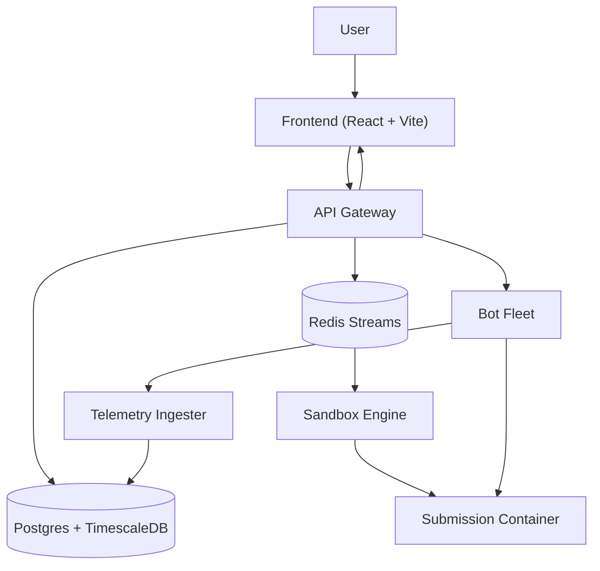

# TradeBench

  
  
  
  
  


**Distributed Benchmarking Platform for Trading Exchange Engines**

Upload → Sandbox → Benchmark → Score → Live Leaderboard

---

## Overview

TradeBench is a distributed benchmarking platform that evaluates contestant trading exchange implementations under realistic market stress.

Users upload their exchange as a ZIP archive containing a Dockerfile and source code.

The platform:

- Builds the submission inside Docker
    
- Runs it in an isolated sandbox
    
- Executes large-scale concurrent benchmarks
    
- Measures throughput and latency
    
- Validates correctness
    
- Computes a composite score
    
- Publishes rankings in real time
    

---

# Motivation

Evaluating trading engines manually is:

- inconsistent
    
- impossible to scale
    
- unrealistic under concurrency
    

TradeBench automates the entire process.

Every submission goes through the exact same pipeline:

```text
Upload
↓

Sandbox Build

↓

Health Check

↓

Benchmark

↓

Telemetry Aggregation

↓

Score Computation

↓

Leaderboard
```

---

# Architecture



---

# Features

### Secure Sandbox Execution

- Docker isolated containers
    
- Internal benchmark network
    
- Read-only root filesystem
    
- Non-root execution
    
- CPU and memory limits
    
- Capability dropping
    

---

### Distributed Bot Fleet

- Thousands of concurrent bots
    
- LIMIT / MARKET / CANCEL orders
    
- Warmup
    
- Ramp-up
    
- Sustained load
    
- Spike tests
    
- Drain phase
    

---

### Real-time Leaderboard

- Server Sent Events (SSE)
    
- Live rank updates
    
- Throughput
    
- Latency
    
- Correctness
    
- Final score
    

---

### Telemetry Pipeline

Aggregates:

- TPS
    
- p50 latency
    
- p90 latency
    
- p99 latency
    
- Success rate
    
- Failure rate
    
- Correctness score
    

---

# Repository Structure

```text
.

├── services

│ ├── api-gateway

│ ├── sandbox-engine

│ ├── bot-fleet

│ ├── telemetry-ingester

│ └── frontend

│

├── shared

│ ├── proto

│ └── types

│

├── migrations

├── scripts

├── docker-compose.yml

├── Makefile

└── README.md
```

---

# Tech Stack

|Layer|Technology|
|---|---|
|Frontend|React + Vite + TypeScript|
|API|Go|
|Sandbox|Docker SDK|
|Queue|Redis Streams|
|Benchmarking|Go Goroutines|
|Telemetry|gRPC Streaming|
|Database|PostgreSQL|
|Time Series|TimescaleDB|
|Container Runtime|Docker|
|Leaderboard|SSE|

---

# Services

|Service|Responsibility|
|---|---|
|api-gateway|Uploads, status, leaderboard|
|sandbox-engine|Docker build and sandbox|
|bot-fleet|Concurrent benchmark bots|
|telemetry-ingester|Metrics aggregation|
|frontend|Submission UI and leaderboard|

---

# gRPC Contracts

### Sandbox Engine

```protobuf
rpc GetStatus(StatusRequest)
rpc KillContainer(KillRequest)
```

### Bot Fleet

```protobuf
rpc StartBenchmark(BenchmarkConfig)

rpc StopBenchmark(StopRequest)
```

### Telemetry Ingester

```protobuf
rpc StreamEvents(stream BotEventProto)
```

---

# Database Schema

### submissions

Stores:

- submission metadata
    
- docker image tag
    
- container id
    
- benchmark timestamps
    
- status
    

---

### metric_snapshots

Timeseries table storing:

- TPS
    
- p50 latency
    
- p90 latency
    
- p99 latency
    
- success count
    
- failure count
    
- timeout count
    
- correctness
    

---

### scores

Stores:

- throughput score
    
- latency score
    
- correctness score
    
- final score
    
- disqualification state
    

---

# REST API

### Submission

|Method|Endpoint|
|---|---|
|POST|`/api/submissions`|
|GET|`/api/submissions/:id/status`|
|GET|`/api/submissions/:id/results`|

---

### Leaderboard

|Method|Endpoint|
|---|---|
|GET|`/api/leaderboard`|
|GET|`/api/leaderboard/stream`|

---

### Admin

|Method|Endpoint|
|---|---|
|POST|`/api/admin/benchmark/:id/start`|
|POST|`/api/admin/benchmark/:id/stop`|

---

# Benchmark Pipeline

```text
User Upload

↓

SHA256 Dedup

↓

Save ZIP

↓

Redis Stream enqueue

↓

Sandbox Engine consumes job

↓

Docker Build

↓

Docker Run

↓

Health Check

↓

Bot Fleet Benchmark

↓

Telemetry Stream

↓

Metrics Aggregation

↓

Score Computation

↓

Leaderboard Update
```

---

# Scoring

Final score:

```text
Final Score

=

0.40 × Throughput

+

0.40 × Latency

+

0.20 × Correctness
```

A submission is disqualified when:

```text
Correctness Score < 30%
```

---

# Security

TradeBench executes untrusted code.

Sandbox containers run with:

- non-root user
    
- read-only filesystem
    
- `/tmp` writable only
    
- no Linux capabilities
    
- memory limit
    
- CPU limit
    
- internal isolated network
    
- internet disabled
    

Only Bot Fleet can access benchmark containers.

---

# Local Setup

### Clone

```bash
git clone <repo>

cd tradebench
```

---

### Start everything

```bash
make up
```

---

### Stop

```bash
make down
```

---

### Migrations

```bash
make migrate
```

---

### Generate Protobuf

```bash
make proto
```

---

### E2E Test

```bash
make test-e2e
```

Pipeline:

```text
Upload

↓

BUILDING

↓

RUNNING

↓

BENCHMARKING

↓

SCORED
```

---

# Screenshots

### Submission Page

```text
[ Screenshot Placeholder ]
```

### Live Leaderboard

```text
[ Screenshot Placeholder ]
```

### Benchmark Pipeline

```text
[ Screenshot Placeholder ]
```

---

# Future Improvements

- Kubernetes deployment
    
- Horizontal bot scaling
    
- Prometheus integration
    
- Grafana dashboards
    
- Persistent queue abstraction
    
- Distributed telemetry aggregation
    
- Multi-region benchmarking
    
- WASM sandbox experimentation
    

---

# Contributors

Built for:

**IICPC Summer Hackathon 2026**

Contributors:

- Backend Engineering
    
- Distributed Systems Engineering
    
- Frontend Engineering
    

---

## License

MIT License

Use it responsibly.

The containers won't.
